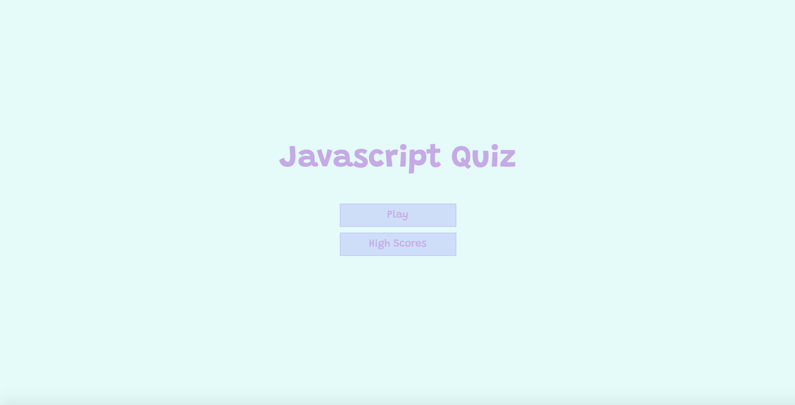
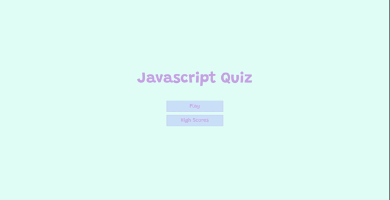

# Javascript Quiz

## Table of Contents
*  [Description](#description)
*  [User Story](#user-story)
*  [Features of the Application](#features-of-the-application)
*  [Preview of the Javascript Quiz](#preview-of-the-javascript-quiz)
*  [Links](#links)
*  [License](#license)
*  [Contributing](#contributing)
*  [Questions](#questions)

## Description

As a web developer, completing coding assessments (which usually entails a combination of multiple-choice questions and interactive challenges) is a customary task. The Javascript Quiz is a coding quiz with 10 multiple-choice questions. The application is a fun and dynamic way to see how much you know, or don't know, about Javascript. You will get 10 points for each correct answer. (Maximum score is 100 points.) At the end of the quiz, your total score will be displayed and you will be given the opportunity to add your name to the high scores list. 

The Javascript Quiz features dynamically updated HTML and CSS powered by Javascript, with the use of local storage to save the user's high scores. It also features a clean and polished user interface that is responsive, ensuring that it adapts to multiple screen sizes.

## User Story
~~~
AS A student  
I WANT to take a quiz on JavaScript fundamentals that stores high scores  
SO THAT I can gauge my progress compared to my peers.  
~~~

## Features of the Application
~~~
GIVEN I am taking a coding quiz  
WHEN I click the start button  
THEN I am presented with a question.  

WHEN I answer a question  
THEN I am presented with another question.  

WHEN I answer a question  
THEN the progress bar dynamically updates.  

WHEN I answer a question correctly  
THEN the current score increases by ten points.  

WHEN all of the questions are answered  
THEN the quiz is over.  

WHEN the quiz is over  
THEN I can save my name and score.  
~~~

## Preview of the Javascript Quiz

The following animation demonstrates the application functionality:

## Links
- [Deployed Application](https://rh9891.github.io/JavascriptQuiz)
- [Github Repository](https://github.com/rh9891/JavascriptQuiz)

## License

This application does not currently have any licenses.

The user is not permitted to use, modify, or share any parts of it. Though the code for this application is hosted on Github, where you are allowed to view and fork the code, this does not imply that the user is permitted to use, modify, or share the contents of this application for any purpose.

## Contributing

If you would like to contribute to this repository, please contact me via [Github](https://github.com/rh9891).

## Questions

If you have any questions, comments, or issues regarding this application, please do not hesitate to contact me via [Github](https://github.com/rh9891).